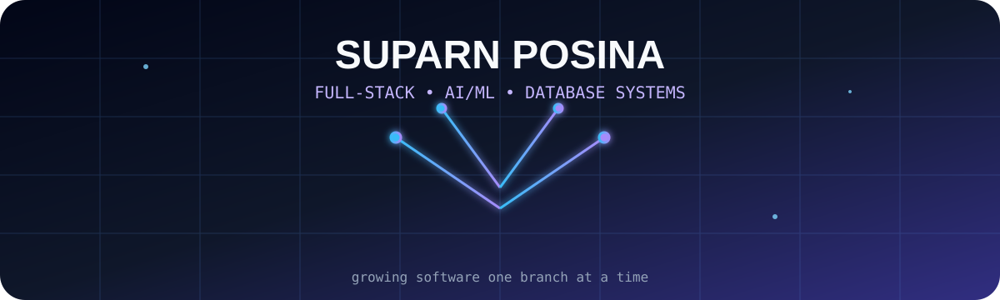
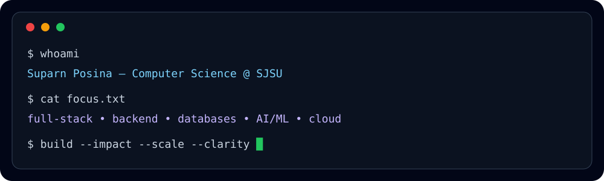
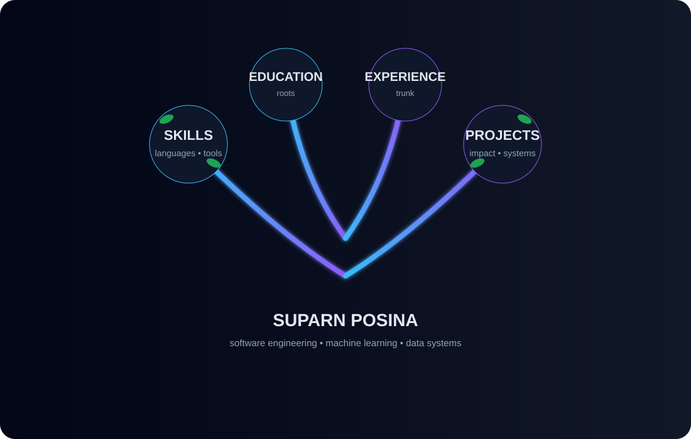
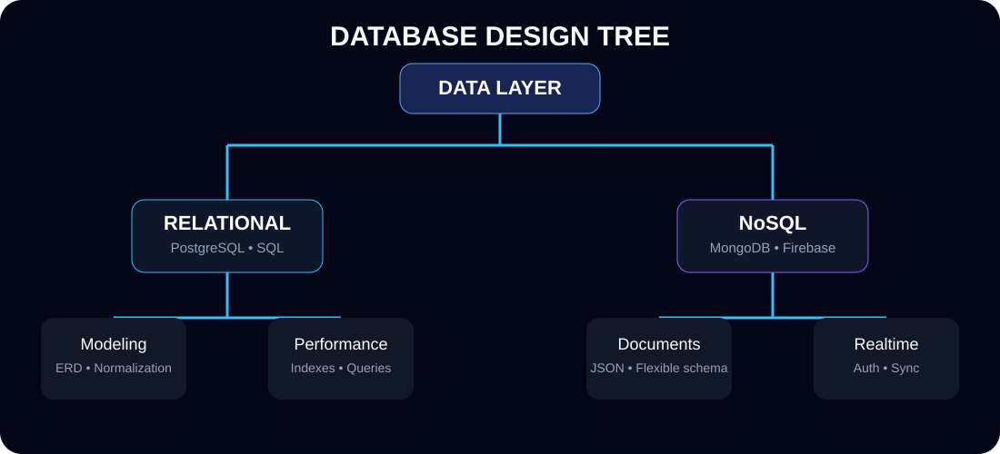
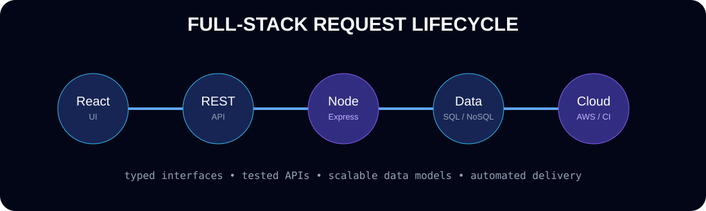
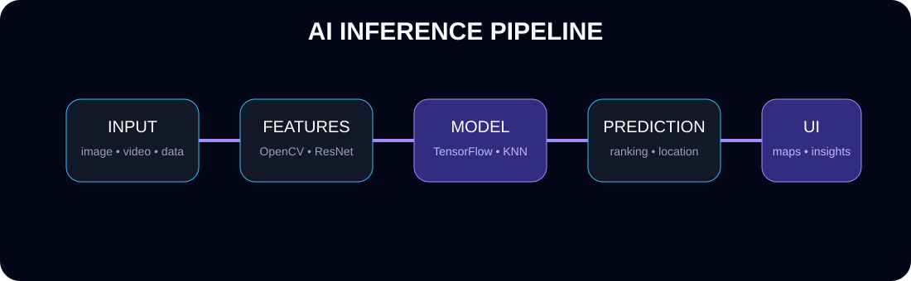

<p align="center">
  
</p>

<p align="center">
  <a href="https://github.com/oops408"></a>
  
  
  
</p>

<p align="center">
  <b>Software engineer focused on full-stack systems, AI/ML, backend architecture, and database design.</b>
</p>

<p align="center">
  
</p>

---

## 🌳 Developer Tree

<p align="center">
  
</p>

---

## 🌿 Skills

<table>
<tr>
<td valign="top" width="33%">

### Languages

`Java` `Python` `C` `C++` `JavaScript` `TypeScript` `SQL` `Swift`

### Frontend

`React` `Vite` `HTML` `CSS` `Leaflet.js`

</td>
<td valign="top" width="33%">

### Backend

`Node.js` `Express.js` `Flask` `REST APIs` `Firebase`

### Data

`PostgreSQL` `MongoDB` `NoSQL` `Schema Design` `Data Modeling`

</td>
<td valign="top" width="33%">

### AI / Cloud / Delivery

`TensorFlow` `OpenCV` `ResNet` `KNN` `AWS` `Docker` `CI/CD` `Postman`

### Engineering

`OOP` `Testing` `Debugging` `Automation` `Agile` `Technical Communication`

</td>
</tr>
</table>

<p align="center">
  
</p>

---

## 🗄️ Database Design

<p align="center">
  
</p>

I design data layers around clear schemas, reliable API contracts, and scalable access patterns. My work spans relational modeling in PostgreSQL, flexible document workflows in MongoDB, and real-time authentication/data synchronization with Firebase.

---

## ⚛️ Full-Stack Architecture

<p align="center">
  
</p>

My preferred workflow connects a typed, responsive frontend to modular REST endpoints, a testable backend service layer, and a purpose-built database model, then ships through Docker and CI/CD.

---

## 🧠 AI / ML Systems

<p align="center">
  
</p>

I build applied ML systems that turn raw images, video, and structured data into usable predictions, rankings, and decision-support interfaces.

---

## 🍎 Featured Projects

### Investment Property Finder with AI-Driven Financial Analysis

**Node.js · React · REST APIs · AI/ML · Database Design · Data Modeling**

- Designed and developed a full-stack application used by **100+ users** to evaluate investment properties through location data, financial metrics, AI-assisted analysis, and database-backed comparisons.
- Built backend data models and ranking workflows to process nationwide realtor data and support scalable property evaluation.

```text
Property Data → API Layer → Financial Model → AI Analysis → Ranked Results → User Comparison
```

### AI-Integrated YouTube Video Scheduler and Uploader

**TypeScript · Node.js · Express.js · PostgreSQL · Docker · CI/CD · Postman**

- Created a full-stack scheduling platform used by **1,000+ active users**, handling **300+ daily requests** across upload, metadata, scheduling, and analytics workflows.
- Developed and tested modular REST API endpoints backed by PostgreSQL, Git-based delivery, Docker, and CI/CD automation.

```text
Dashboard → Scheduler API → PostgreSQL → Upload Queue → YouTube API → Analytics
```

### Real-Time Location Prediction from Images and Video

**Python · Flask · OpenCV · ResNet · KNN · TensorFlow · AWS · Leaflet.js**

- Engineered a computer vision application supporting **150 concurrent peak users** and producing AI-assisted location predictions from image/video inputs.
- Integrated feature extraction, prediction, map visualization, REST APIs, and cloud deployment with a four-person agile team.

```text
Image / Video → OpenCV → ResNet Features → KNN → Location Prediction → Leaflet Map
```

---

## 💼 Experience

### Sales Engineering Intern — Infoglen
**San Jose, California · August 2025 – Present**

- Prototyped AI-based tools for customer lifecycle analysis, including churn-risk assessment and sentiment analysis.
- Connected AI/ML concepts, automation opportunities, and customer-facing business requirements through iterative team feedback.

### Backend Developer — ROID
**Remote · March 2024 – July 2024**

- Built authentication, hosting, and backend workflow features using Swift and Firebase.
- Developed REST APIs for scheduling, uploading, and management workflows while collaborating through Git, code review, and testing/debugging practices.

### Math Instructor — Mathnasium
**Mountain View, California · September 2024 – June 2025**

- Taught mathematics from foundational topics through Calculus while supporting multiple students concurrently.
- Earned **Tutor of the Month** recognition for communication, reliability, teamwork, and student support.

---

## 🎓 Education

### San José State University
**B.S. Computer Science · Minor in Business · Spring 2027**

- GPA: **4.0**
- Coursework: Data Structures & Algorithms, Database Management Systems, Object-Oriented Design, Operating Systems, Information Security, Data Science, Advanced Java, Assembly & Architecture, Technical Writing

### De Anza College
**A.S.T. Mathematics · February 2025**

- GPA: **3.97**
- Co-Founder, Data Science Club
- Secretary, Chess Club
- Vice President, Personal Finance Club

---

## 📊 GitHub Analytics

<p align="center">
  
  
</p>

<p align="center">
  
</p>

<p align="center">
  
</p>

<p align="center">
  
</p>

---

## 🐍 Contribution Graph

<p align="center">
  
</p>

> The included GitHub Actions workflow generates this SVG automatically on the `output` branch.

---

## 🌱 Currently Growing

`Distributed Systems` · `System Design` · `LLM Engineering` · `High-Performance Databases` · `Cloud Architecture` · `Computer Vision`

---

## 📬 Connect

<p align="center">
  <a href="https://github.com/oops408"></a>
</p>

<!-- Add your LinkedIn, portfolio, email, LeetCode, Spotify, and WakaTime links here once available. -->

<p align="center">
  
</p>
